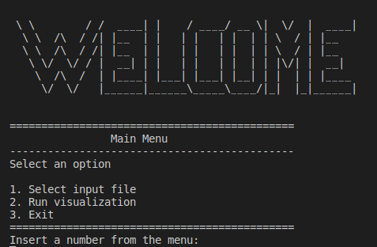
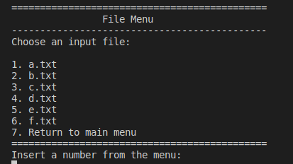
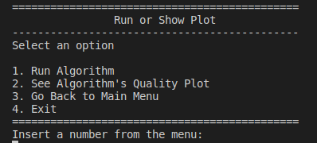
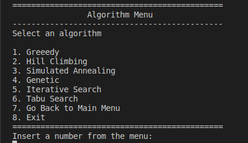
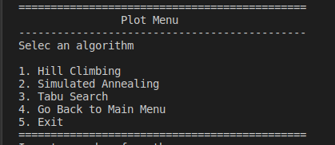
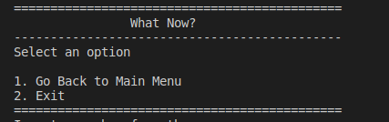

# Traffic Signalling Optimization

# G64 3A

## Requirements

- Python interpreter

- Python Packages

> Install requirements using ```pip install -r requirements.txt``` on the /src/ folder


## Run

Run the program using:

>python main_script.py


## How to use

After running the main_script.py the main menu appears


### MainMenu


> 1 Select input to be read \
> 2 See the graphic execution of the simultaion \
> 3 Exit

### FileMenu



> 1-6 Inputs that can be selected. \
> 7 Return to main menu

### Run or Show Menu



> 1 Go to algorithm menu \
> 2 Go to plot menu \
> 3 Return to mainmenu \
> 4 Exit

### Algorithm Menu


> 1-6 Select which algorithm to run \
> 7 Return to Main Menu \
> 8 Exit

### Plot Menu



> 1-3. Algortihms to plot \
> 4 Return to main menu \
> 5 Exit program


### What Now Menu



> 1 Return to main menu \
> 2 Exit program


## Group Members

Sofia Germer, up201907461
Pedro Jesus, up201907523
Sérgio Estêvão, up201905680