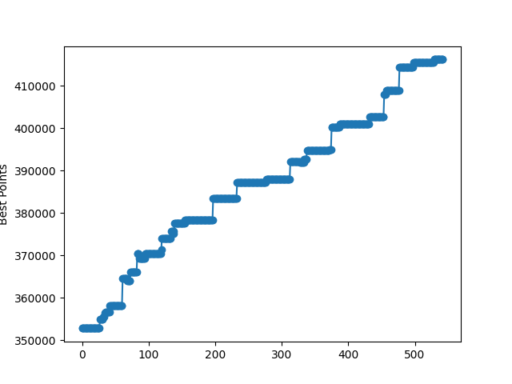

# Results

## Simulated Annealing

### 1. (old data parameters)

- **Light change odd:** 50
- **Light variation amplitude:** 3
- **Temperature**: simulation.points_per_car * 5
- **Cooling**: 0.7
- **Runs per temperature**: 30
- **Stop criteria**: self.temperature > self.init_temperature/1000