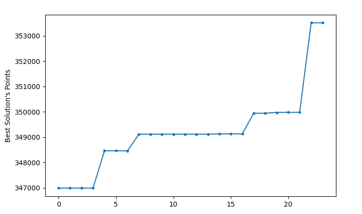
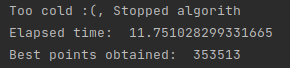
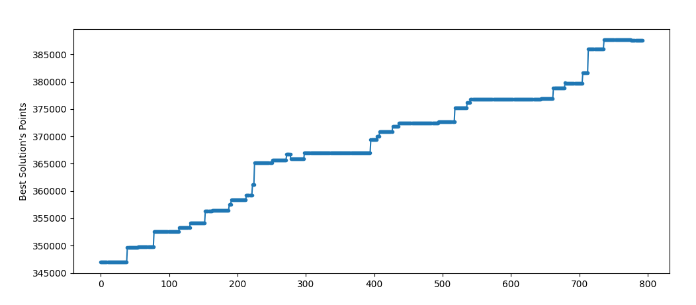
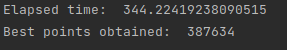
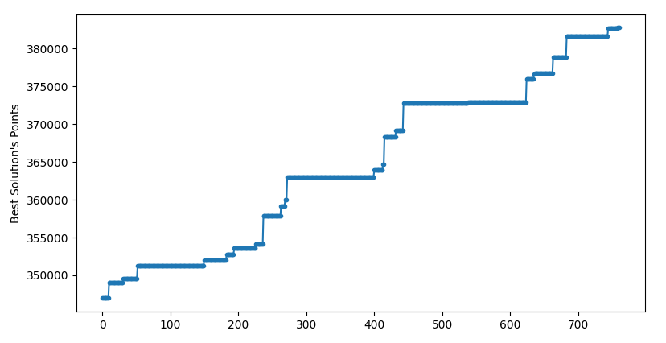
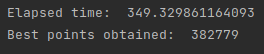
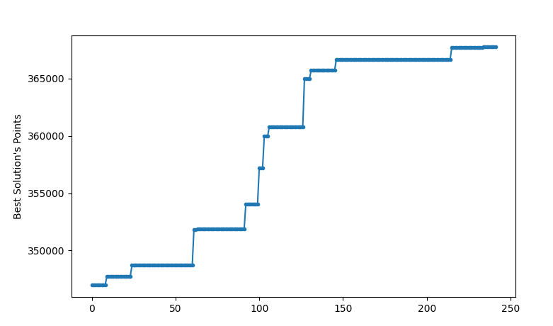
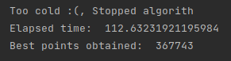

# Results

## Simulated Annealing

### 1. (old data parameters)

- **Light change odd:** 50
- **Light variation amplitude:** 3
- **Temperature**: simulation.points_per_car * 5
- **Cooling**: 0.7
- **Runs per temperature**: 30
- **Stop criteria**: self.temperature > self.init_temperature/1000

### Marathon 1.
- **Light change odd:** 50
- **Light variation amplitude:** 3
- **Temperature**: 10000
- **min_Temperature**: 0.1
- **max iterations**: 1000
- **Runs per temperature**: 1
- **Starting solution**: +/- 374 cars

#### Exponential cooling

#### Logarithmic cooling

#### Linear cooling

#### Quadratic cooling

