# Results

## Simulated Annealing

### 1. (old data parameters)

- **Light change odd:** 50
- **Light variation amplitude:** 3
- **Temperature**: simulation.points_per_car * 5
- **Cooling**: 0.7
- **Runs per temperature**: 30
- **Stop criteria**: self.temperature > self.init_temperature/1000

### Marathon 1.
- **Light change odd:** 50
- **Light variation amplitude:** 3
- **Temperature**: 1000
- **min_Temperature**: 0.1
- **max iterations**: 1000
- **Runs per temperature**: 1
- **Starting solution**: +/- 374 cars

#### Exponential cooling

#### Logarithmic cooling

#### Linear cooling

#### Quadratic cooling

#### Observations

- Starting temperature was too low

### Marathon 2.
- **Light change odd:** 50
- **Light variation amplitude:** 3
- **Temperature**: 3000
- **min_Temperature**: 0.1
- **max iterations**: 1000
- **Runs per temperature**: 1
- **Starting solution**: 375 cars (347279 points)

#### Exponential cooling

(too cold)

#### Logarithmic cooling

#### Linear cooling

#### Quadratic cooling

#### Observations

- Selection of worst solution was more visible, specially in the logarithmic cooling, however it still isn't frequent.

- Linear cooling was the best one

### Marathon 3.
- **Light change odd:** 50
- **Light variation amplitude:** 3
- **Temperature**: 5000
- **min_Temperature**: 0.1
- **max iterations**: 1000
- **Runs per temperature**: 1
- **Starting solution**: 374 cars (353178 points)

#### Exponential cooling

#### Logarithmic cooling

#### Linear cooling

#### Quadratic cooling

#### Observations

- Logarithmic cooling went nuts
- Progression in other cooling methods remained the same

### Marathon 4.
- **Light change odd:** 50
- **Light variation amplitude:** 3
- **Temperature**: 4000
- **min_Temperature**: 0 (only stops when the 500 iterations are achived)
- **max iterations**: 500
- **Runs per temperature**: 1
- **Starting solution**: 384 cars (356781 points)

#### Exponential cooling (0.9 instead of 0.7)

#### Logarithmic cooling

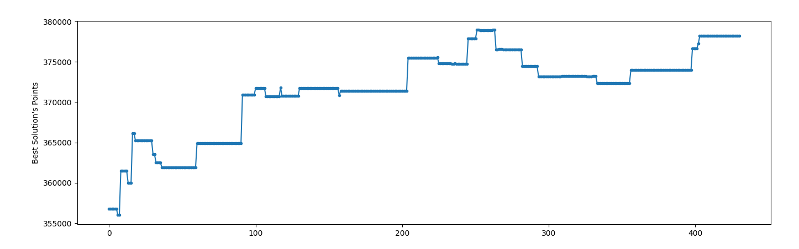
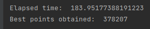

#### Linear cooling

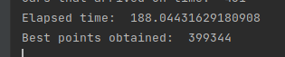

#### Quadratic cooling

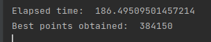

#### Observations

### Marathon 5. (TO-DO)
- **Light change odd:** 50
- **Light variation amplitude:** 3
- **Temperature**: 4000
- **min_Temperature**: 0 (only stops when the 1000 are achived)
- **max iterations**: 500
- **Runs per temperature**: 3
- **Starting solution**:  cars ( points)

#### Exponential cooling (0.9 instead of 0.7)

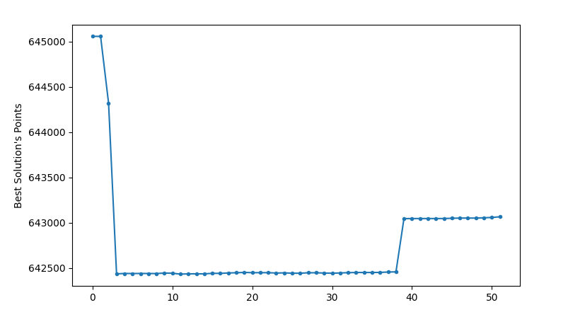 
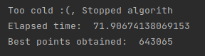

#### Logarithmic cooling

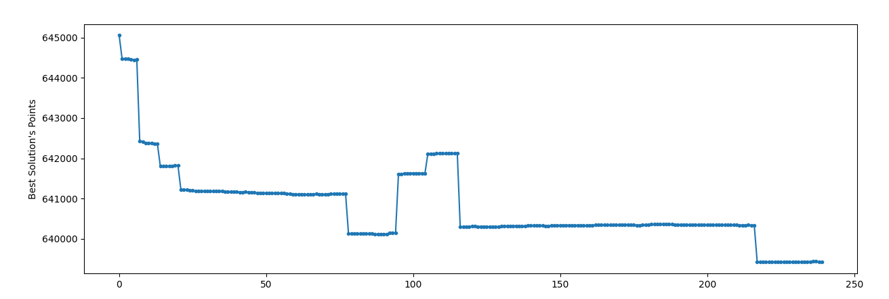
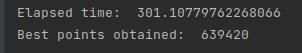

#### Linear cooling

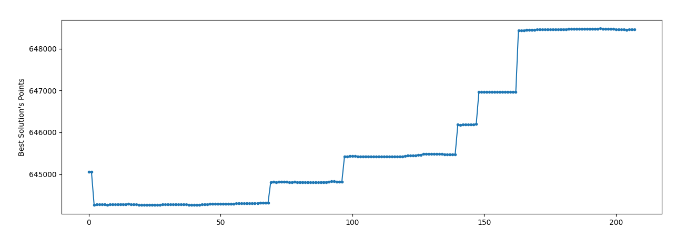

#### Quadratic cooling

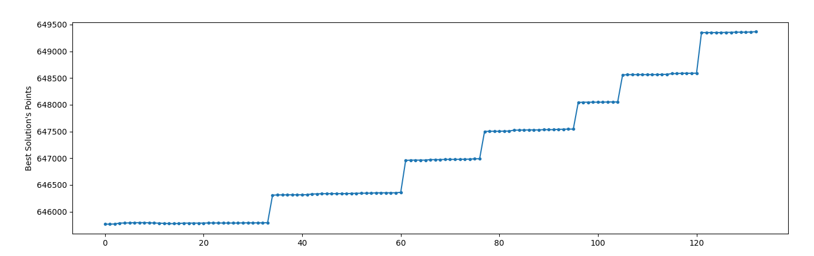
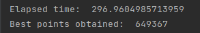

#### Observations

### Marathon 6. (TO-DO)
- **Light change odd:** 50
- **Light variation amplitude:** 3
- **Temperature**: 4000
- **min_Temperature**: 0.01
- **max iterations**: 1000
- **Runs per temperature**: 1
- **Starting solution**:  Greedy

#### Exponential cooling (0.9 instead of 0.7)

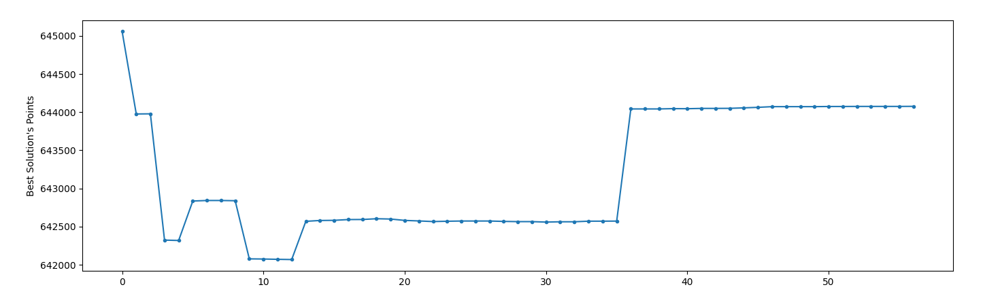 
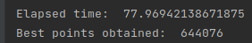

#### Logarithmic cooling

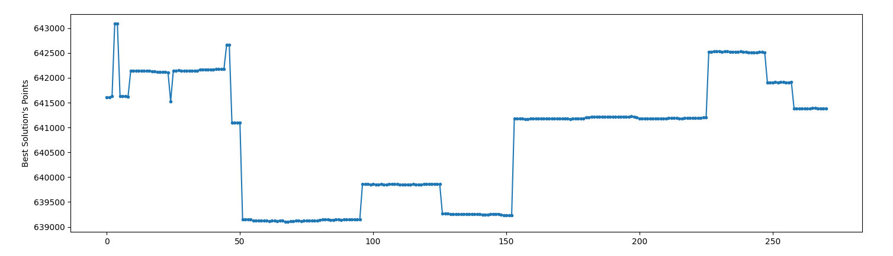
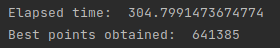

#### Linear cooling

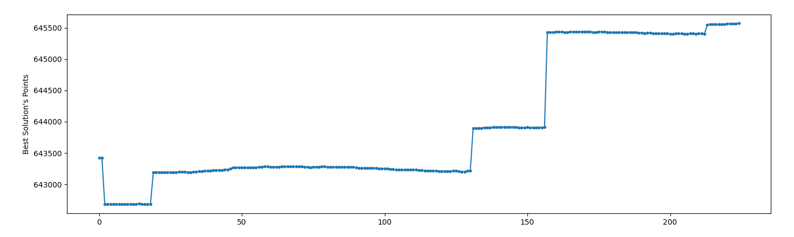
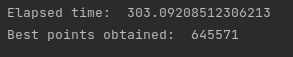

#### Quadratic cooling

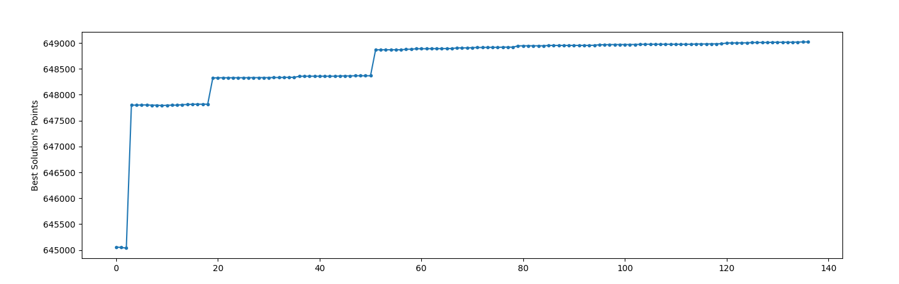

#### Observations

